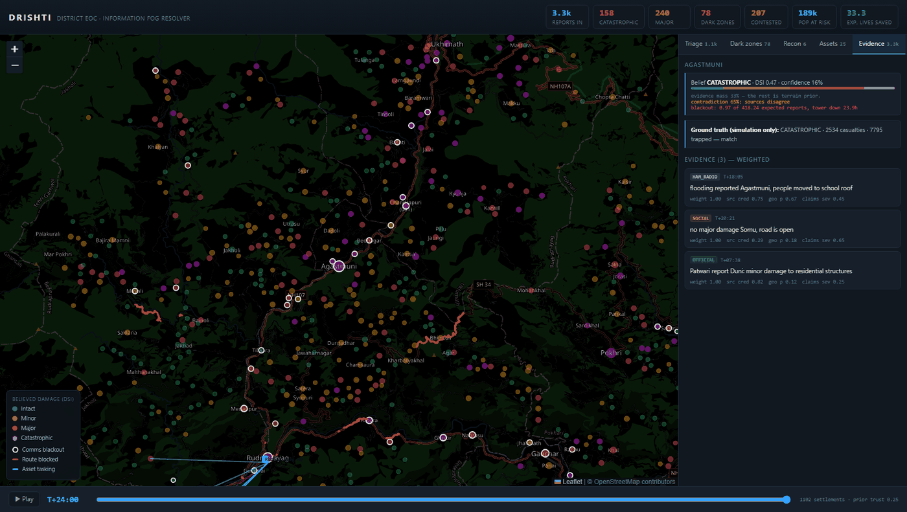

# DRISHTI — Post-Disaster Information Fog Resolver

**Avinya 2026 · Final Round · Problem Statement 5 · Track: Prakriti**

> In the first 24 hours after a multi-hazard disaster, a District Emergency
> Operations Centre is flooded with fragmentary, contradictory, unverified
> reports — and hears **nothing at all** from the places that were hit hardest,
> because the people and the cell towers are both gone.
>
> Rank by report volume and you rank the worst-hit villages as *fine*.

DRISHTI turns that fog into a calibrated, auditable belief about every
settlement in the district, and converts it into an asset-deployment plan over
a road network that has itself been damaged.

**Built in one hackathon, on ₹0. No paid APIs, no API keys, no cloud.**



---

## The one-sentence idea

**Silence is evidence.** A village that should be reporting and isn't — whose
tower has stopped answering, in terrain that says it was exposed — is not a
village that is fine. It is the most likely place to find the dead.

The screenshot above is that claim working: **Agastmuni**, 3 reports received
where 418 were expected, ranked #1 in the district by DRISHTI. Ground truth:
2,534 casualties.

Every report-driven system in existence ranks those villages last, because
they generate no reports. Measured on our benchmark, for settlements that
never sent a single report, a report-driven system scores **ROC-AUC 0.500** —
a coin flip, by construction. DRISHTI scores **0.848**.

---

## Headline results

Scored against hidden ground truth, at T+24h, with a realistic budget of 40
deployments. `evaluate.py`, `metrics.py`, `validate.py`.

### Operational — did we send help to the right places?

| Method | Catastrophic zones found | People reached |
|---|---:|---:|
| Rank by report **volume** (what a live dashboard does) | 2 / 122 | 1,006 |
| Rank by **loudest** claim (what panic does) | 8 / 122 | 506 |
| **Average** the claims (what a spreadsheet does) | 12 / 122 | 484 |
| **DRISHTI** | **12 / 122** | **6,057** |

**6× more catastrophic zones found. 6× more people reached.**

### Detection — does belief track truth?

ROC-AUC for *"is this settlement truly MAJOR or CATASTROPHIC"*.
The right-hand column is the population this problem is actually about:
settlements that never sent a report.

| Variant | All settlements | Never reported |
|---|---:|---:|
| **DRISHTI (full)** | **0.857** | **0.848** |
| − silence engine | 0.795 | 0.711 |
| − terrain prior | 0.800 | 0.846 |
| − independence weighting | 0.840 | 0.848 |
| − source credibility | 0.834 | 0.848 |
| reports only (no inference) | 0.697 | **0.500** |

### Calibration — can an officer trust the number?

Temperature and triage bands are fitted on a **different scenario seed
(77777)** and evaluated on the demo scenario (20260830), so every number below
is out-of-sample.

| Metric | Value |
|---|---:|
| ROC-AUC (severe vs not) | 0.857 |
| Brier score | 0.158 |
| Expected Calibration Error | 0.090 |
| Exact 4-class accuracy | 42.7% |
| **Within one severity band** | **91.0%** |
| Predicted state mix vs truth | 33/31/22/14 vs 32/34/23/11 |

Most important single row of the confusion matrix: **of 122 truly
catastrophic settlements, 2 are labelled INTACT.** The system does not tell
you a destroyed village is fine.

### Correctness

- **30/30** unit and property tests pass (`pytest test_drishti.py`)
- **39/39** real-world checks pass (`validate_real.py`) — real coordinates,
  published elevations, seismic attenuation vs published MMI, live feeds,
  fuzzy resolution of real misspellings

---

## Try it

### Live app (full features)

```bash
pip install -r requirements.txt
cd drishti/backend
python run_all.py          # regenerate scenario + all metrics (~50s)
python app.py              # then open http://127.0.0.1:8000
```

### Static demo (no Python)

The `docs/demo/` folder is a self-contained build — pure HTML + JSON, no
backend. Enable GitHub Pages (*Settings → Pages → deploy from branch,
`/docs`*) and open `https://<user>.github.io/<repo>/demo/`.

---

## How it works

Five mechanisms, in order. Full detail in **[docs/HOW_IT_WORKS.md](docs/HOW_IT_WORKS.md)**.

### 1 · Geo-resolution that keeps its doubt

A ground report says *"the village past Gaurikund"*. This district contains
**four** villages called Chandrapuri and **three** called Kund, and 42 names
are shared by three or more settlements. Rather than guess, a report resolves
to a **probability distribution** over settlements, and its evidence is split
accordingly. Ambiguity is preserved all the way to the deployment decision.

### 2 · A corroboration graph, so panic can't vote twice

Near-duplicate reports are clustered (TF-IDF over character n-grams, blocked
by resolved settlement), and the *k*-th message from the same channel within a
cluster is discounted geometrically. One rumour shared 90 times counts as
roughly one witness, not ninety. In the demo scenario, **913 of 3,256 reports
are false**, most of them amplified panic; the engine down-weights them
without ever needing to know which ones they were.

### 3 · Dempster–Shafer fusion, in closed form

Each report is a *simple support function*: mass on one damage state, the rest
on "don't know". For simple support functions the n-fold Dempster combination
collapses to a closed form,

```
q(s) = Π (mᵢ(s) + mᵢ(Θ)) − Π mᵢ(Θ)        q(Θ) = Π mᵢ(Θ)
```

computed in log space, so ten thousand reports never underflow. The mass
left on Θ is reported honestly as `evidence_mass` — the UI shows you how much
of any belief is actually evidenced versus assumed.

### 4 · Silence as evidence — the differentiator

> **Agastmuni**, a town of 19,758 people, sent **3 reports when 418 were
> expected**, tower down 23.9 hours. DRISHTI ranks it #1 in the district.
> Ground truth: catastrophic — **2,534 casualties, 7,795 trapped**.
> On a volume dashboard it is one of the quietest places on the map.


Chatter volume alone cannot separate *"quiet because unharmed"* from *"quiet
because gone"*: undamaged villages are quiet too. So the engine uses a second,
independent observation — **cell-tower liveness**, exactly the feed DoT/TRAI
supply to a State EOC.

Crucially, towers also die from plain power loss. In our scenario the grid is
cut across whole feeder zones (the scenario of PS-4 in this same problem set),
so **51% of undamaged villages also go dark**. Tower-down is therefore *weak*
evidence, and is combined Bayesianly with terrain exposure and chatter deficit
rather than trusted on its own.

> We caught this ourselves: an earlier version had P(tower down) = 0.06 for
> intact villages and 0.94 for catastrophic ones, which made tower status a
> near-copy of the answer. The grid-failure confounder exists specifically so
> the silence engine has to earn its result. See
> [HOW_IT_WORKS](docs/HOW_IT_WORKS.md#what-we-got-wrong-and-fixed).

### 5 · Two queues, deliberately separated

- **Rescue queue** — scarce assets (boats, excavators, medical teams) go where
  the *calibrated probability* of severe damage justifies the trip, ranked by
  expected lives saved per asset-hour over the **damaged** road graph.
- **Recon queue** — cheap drones go where uncertainty is most *expensive*:
  highest stakes × lowest confidence.

Sending an excavator on an inference wastes it. Sending a drone on an
inference earns you the right to send the excavator.

### And: the engine knows what it doesn't know

The terrain prior is not trusted by assumption. Every cycle it is regressed
against settlements where ground evidence is strong, and shrunk toward
district climatology by its measured skill. In the demo scenario it earns a
trust of **0.27** — the engine has worked out that terrain is only weakly
predictive this time, and leans on reports instead.

---

## Data — all free, no keys, ₹0

| Source | Used for | Cost |
|---|---|---|
| **OpenStreetMap** (Overpass) | 2,059 settlements, 401 roads, 125 bridges, 60 rivers | free |
| **Open-Meteo elevation** | real terrain, 569–3,544 m | free, no key |
| **Open-Meteo forecast** | live rainfall over the district | free, no key |
| **USGS FDSN** | live earthquake catalogue | free, no key |
| **Leaflet + OSM tiles** | the map | free, no key |

Everything is cached to disk; the dashboard runs **fully offline** after first
fetch, and says so when a feed is stale. A disaster tool that dies when the
network does would be self-defeating — and so would a hackathon demo on venue
wifi.

**Study area:** Rudraprayag–Chamoli, Uttarakhand — the 2013 Kedarnath
corridor. Seismic Zone V, landslide-prone, real flash-flood history.

---

## Repository layout

```
drishti/backend/
  config.py        all tunables + published seismic relation
  gazetteer.py     OSM settlements, terrain exposure, fuzzy geo-resolution
  simulate.py      scenario engine — hidden ground truth + report stream
  extract.py       Hinglish claim extraction (rule-based, LLM optional)
  fusion.py        THE ENGINE — corroboration, DS fusion, silence, triage
  allocate.py      damaged road graph, asset tasking, recon tasking
  calibrate.py     temperature + triage bands, fitted on a held-out seed
  metrics.py       ROC-AUC + ablations
  validate.py      confusion matrix, calibration curve, Brier, ECE
  evaluate.py      operational benchmark vs the baselines EOCs use today
  validate_real.py 39 checks against published real-world facts
  test_drishti.py  30 unit + property tests
  app.py           FastAPI service
  run_all.py       reproduce every number in this README
  export_static.py build the GitHub Pages demo
drishti/frontend/
  index.html       the EOC dashboard (no build step; runs live or static)
docs/
  HOW_IT_WORKS.md  the technical deep-dive
  PITCH.md         3-minute demo script + judge Q&A
  demo/            static GitHub Pages build
```

---

## Honest limitations

We would rather state these than have them found.

- **The scenario is simulated.** It has to be — the whole problem is that
  truth is unknown, so proving recovery of truth requires a world where truth
  exists. The simulator is adversarial by design (45% of settlements never
  report, 28% of reports are false, the grid confounds tower status, and 80%
  of damage is driven by a latent vulnerability field no map layer can see).
  It is still a simulator.
- **Exact 4-class accuracy is 42.7%.** Ordinal accuracy is what matters
  operationally (91.0% within one band, 2/122 catastrophic mislabelled
  INTACT), but we are not going to quote only the flattering number.
- **Population is estimated** from OSM place class where Census figures are
  absent.
- **The LLM tier is optional and off by default.** Rules-only keeps the demo
  deterministic and free; `GROQ_API_KEY` enables refinement, and the pipeline
  falls back silently if it fails.
- **Tower liveness is modelled, not live.** In deployment this comes from
  DoT/TRAI; we model it, including its confounders.

---

## Licence

MIT — see [LICENSE](LICENSE).
