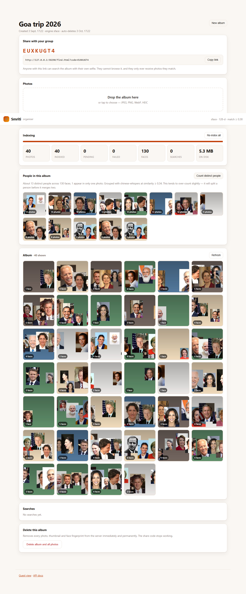
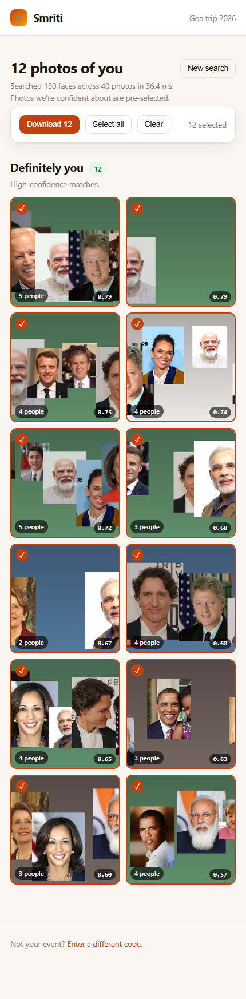

# Smriti — find every photo you're in

**One person uploads the album. Everyone else uploads a selfie and gets their own photos back.**

A hundred people go on a trip. Six of them have cameras. What follows is always
the same: a 2,000-photo Google Drive folder, a WhatsApp group full of "can
someone send me the ones with me in them", and ninety-four people who never
scroll far enough to find themselves.

Smriti is the missing step. The organiser uploads the album once. Every face in
every photo is detected and turned into a numeric fingerprint. A guest opens a
link, takes one selfie, and gets back **only the photos they appear in** —
ranked by confidence, with a one-click ZIP.

Self-hosted, no third-party service, no API keys. Faces never leave your machine.

```
                                     ┌──────────────┐
   organiser ──── 2,000 photos ────► │              │  detect + embed
                                     │    Smriti    │  every face once
   guest ──────── 1 selfie ────────► │              │  ────────────────►  your 23 photos
                                     └──────────────┘  one matrix multiply
```

---

## Quick start

```bash
cd smriti
python -m venv .venv && .venv/Scripts/activate      # Linux/macOS: source .venv/bin/activate
pip install -r requirements.txt

python run.py                                        # http://127.0.0.1:8000
```

The first start downloads ~40 MB of model weights into `data/weights/`. Open
<http://127.0.0.1:8000/admin.html>, create an album, drop photos in, and share
the 8-character code.

To let people on the same Wi-Fi reach it from their phones:

```bash
python run.py --host 0.0.0.0     # prints the LAN address guests should open
```

With Docker:

```bash
docker compose up --build        # http://localhost:8000
```

| The organiser's view | What a guest gets |
|---|---|
|  |  |

*(Both captured by `scripts/uitest.py` against a live server. The album is
composited from public-domain portraits — see [Measuring it yourself](#measuring-it-yourself).)*

### Try it in one command

No album handy? Build one with known ground truth from any folder-per-person
dataset (see [Measuring it yourself](#measuring-it-yourself)) and score the
whole product on it:

```bash
python scripts/make_demo.py --dataset ./dataset --photos 60 --evaluate
```

---

## How it works

### Indexing (once, when the organiser uploads)

1. **Decode and orient.** EXIF rotation is applied first. A portrait photo
   stored as landscape-with-a-flag has every face lying on its side, and the
   detector simply misses them.
2. **Detect.** [YuNet](https://github.com/opencv/opencv_zoo) finds face boxes
   plus five landmarks, on a copy downscaled to 1280 px. Full resolution costs
   seconds per 48 MP photo and finds nothing extra that we can usefully embed.
3. **Align and embed.** Each face is warped onto the canonical 112×112 template
   using its landmarks, then embedded into a unit-length vector — **on the
   full-resolution pixels**, because a face 60 px wide in a group shot has few
   enough pixels already.
4. **Store.** The vector goes into SQLite as a float32 blob. The photo is stored
   unmodified; a 480 px thumbnail is generated for the gallery.

Uploading and indexing are decoupled: the HTTP request only hashes, decodes and
thumbnails, then returns. A background pool does the detection, and `pending` is
a durable state in SQLite — so a process killed mid-index resumes on restart
instead of losing the queue.

### Searching (once per guest)

Every embedding is unit length, so cosine similarity is a dot product and the
entire event is one matrix multiply:

```python
scores   = faces @ selfies.T      # (n_faces, n_selfies)
per_face = scores.max(axis=1)     # best-matching selfie for each face
per_photo = max over the faces in that photo
```

Two product decisions live in that snippet:

- **Max, not mean, across a guest's selfies.** Someone who uploads a bright
  selfie and a dim one should match on whichever is closer. Averaging blurs both.
- **Max, not sum, across the faces in a photo.** "Am I in this picture" is one
  boolean, not one per face.

Results come back in **three tiers** rather than behind one threshold. A single
cut-off has to choose between handing you a stranger's photo and hiding one of
yours. Splitting the range lets the confident tier stay conservative while the
long tail is still one click away:

| Tier | Meaning | In the UI |
|---|---|---|
| **sure** | above the high threshold | pre-selected for download |
| **likely** | above the match threshold | shown, not pre-selected |
| **maybe** | above the low threshold | shown under a "might be you" heading |

---

## How well does it work?

Everything below was measured with the scripts in this repo, on 41 public-domain
photos of 11 people from Wikimedia Commons, on a CPU-only Windows laptop. It is a
small set — big enough to show the shape of the problem, too small to resolve a
false-match rate below about 0.1%. **Run it on your own photos before trusting
any of it.**

### Face matching (`scripts/benchmark.py`)

57 genuine pairs, 763 impostor pairs:

| Engine | ROC-AUC | Recall at threshold | False matches | Worst impostor | Speed |
|---|---|---|---|---|---|
| `sface` (default, 128-d) | 0.9995 | **94.7%** @ 0.38 | 1 / 763 (0.13%) | 0.417 | **30 ms/photo** |
| `arcface` (512-d) | **1.0000** | 91.2% @ 0.32 | **0 / 763** | **0.206** | 341 ms/photo |

### The whole product (`scripts/make_demo.py --evaluate`)

60 group photos containing 193 faces, one held-out selfie per person, scored
against an exact answer key:

| Engine | Recall | Precision | Median search |
|---|---|---|---|
| `sface` | 86.8% | **100.0%** | 0.6 ms |
| `arcface` | 84.3% | **100.0%** | 0.4 ms |

**Not one wrong photo was returned to anyone**, on either engine. That is the
number that matters most: the cost of a miss is a photo you can still find in
the "maybe" tier, and the cost of a false positive is a stranger holding your
picture.

### What that means for choosing an engine

`sface` is the default and is the right choice for most albums: it needs no
extra installs, and it is 11× faster.

`arcface` earns its cost through **headroom**, not through the recall column.
Its worst impostor pair scored 0.206 against a 0.32 threshold; SFace's scored
0.417 against a 0.38 threshold — a margin of 0.11 versus −0.04. That margin is
what protects you as the album grows, because every extra face is another chance
to draw a high-scoring stranger. For a 100-person trip, SFace is fine. For a
5,000-person convocation, pay the 11×.

A third engine, `insightface`, runs the same ArcFace weights behind InsightFace's
own detector and downloader (`pip install insightface onnxruntime`). It exists
for people already standardised on that library. **It is the one engine not
exercised end-to-end here** — the adapter and its error paths are tested, the
happy path is not, because `arcface` covers the same weights without the extra
280 MB pack. Treat it as beta.

### Honest limitations

- Recall is not 100%, and won't be. A face turned away from the camera, badly
  out of focus, or 20 px wide is not identifiable — by this system or by you.
- Accuracy is **not uniform across faces.** Face recognition models have
  well-documented accuracy gaps across skin tone, age and gender, driven by
  their training data. This project inherits those gaps and does not correct
  them. The "maybe" tier exists partly so that the people the model serves worst
  still have a path to their photos.
- The demo numbers come from *composited* group photos: real faces, artificial
  arrangement. Real albums are harder.
- The person-count in the organiser view is an **estimate**, and it over-counts.
  On the 193-face demo album containing 11 people it reports 13: nine of the
  eleven are recovered exactly, and a handful of small, soft faces cluster on
  their own rather than joining anyone. It will never merge two people — see
  below — but it will occasionally split one.

### Counting the people in an album

The organiser view answers "how many different people are in here". The obvious
method — link faces above a threshold, take connected components — is forced
into a bad trade: low threshold and it *chains* (A resembles B, B resembles C,
so strangers merge); high threshold and each person shatters into fragments.

[Chinese Whispers](https://en.wikipedia.org/wiki/Chinese_Whispers_(clustering_method))
removes the trade. Faces repeatedly adopt the weighted-most-popular label among
their neighbours, so a single weak edge between two people is outvoted by the
dozens of strong edges inside each. That allows a much more permissive graph.

Measured on the demo album — 193 faces, 11 people, where two faces from the same
photo landing in one cluster is a provable merge error:

| Link threshold | Components | Chinese Whispers |
|---|---|---|
| 0.30 | 3 groups, **105 merge errors** | 12 groups, 2 errors |
| 0.34 | 9 groups, 15 errors | **13 groups, 0 errors** |
| 0.38 | 13 groups, 10 errors | 16 groups, 0 errors |
| 0.42 | 16 groups, 0 errors | 16 groups, 0 errors |
| 0.57 | 17 groups, 0 errors | 19 groups, 0 errors |

Components is never better than 16 at any threshold it can safely use, and
collapses the album entirely below 0.42. Chinese Whispers at 0.34 — halfway
between the review floor and the match bar, which is how the default is derived
for any engine — reaches 13 with no merge errors. Compare them yourself:

```bash
python cli.py people <event_id> --method components
python cli.py people <event_id>            # chinese-whispers, the default
```

### Measuring it yourself

Both scripts take any folder-per-person layout — [LFW](http://vis-www.cs.umass.edu/lfw/)'s
layout, or your own photos sorted into folders:

```
dataset/
  alice/  a1.jpg a2.jpg a3.jpg
  bob/    b1.jpg b2.jpg
```

```bash
python scripts/benchmark.py --dataset ./dataset            # model: does A match B
python scripts/make_demo.py --dataset ./dataset --evaluate # product: do I get my photos
```

`benchmark.py` flags folder pairs whose faces score like the same person, because
on scraped datasets those are almost always label errors rather than model
errors — that check is what caught a "Hillary Clinton" folder in which every
photo's largest face was Bill.

---

## Privacy

Face search is a surveillance-shaped technology. Some of these choices cost
features; they are deliberate.

- **A guest's selfie is never written to disk.** It is decoded in memory,
  embedded, matched, and dropped when the request ends. (`SMRITI_STORE_SELFIES`
  exists, defaults to off, and should stay off.)
- **The share code is not a key to the album.** Every search result carries a
  short-lived HMAC-signed URL scoped to one photo and one event, so a guest can
  fetch exactly the photos they matched. Nobody can browse the album, enumerate
  photo ids, or use one guest's link to reach another guest's pictures.
- **The organiser token is stored only as a SHA-256 hash.** It is shown once, at
  creation. We cannot recover it, and neither can anyone who reads the database.
- **Events expire and are deleted, not hidden.** `SMRITI_RETENTION_DAYS`
  defaults to 30; an hourly task removes rows *and* files.
- **The audit log records that a search happened, never who searched.** Counts,
  timings, a truncated salted IP hash for rate limiting. No embeddings, no
  selfies, no names.
- **Deletion is real and immediate.** Deleting a photo removes its faces from
  the index in the same transaction. Deleting an event `rmtree`s its directory.

**What this does not do:** face embeddings are not directly reversible into a
photograph, but they are *not* anonymous — they are biometric data, and in many
jurisdictions (GDPR Art. 9, India's DPDP Act, Illinois BIPA) processing them
needs a lawful basis and usually explicit consent. If you run this for anything
beyond your own friends, tell people before you upload their faces, and get
their agreement. The organiser UI says so; that is not a substitute for actually
doing it.

---

## Architecture

```
smriti/
  smriti/
    config.py     env-driven settings, one frozen dataclass
    db.py         SQLite schema, WAL, per-thread connections
    repo.py       every SQL statement in the project
    storage.py    file layout; one directory per event
    imaging.py    decode, EXIF orientation, thumbnails, blur
    pool.py       bounded pool of model instances
    engines/      base contract + sface / arcface / insightface / mock
    pipeline.py   ingest, background indexer, crash recovery
    matcher.py    the index cache and the search itself
    cluster.py    Chinese Whispers: "how many distinct people are here"
    security.py   tokens, share codes, signed photo URLs, rate limits
    api.py        FastAPI routes
    app.py        app factory, lifespan, retention loop
  web/            three pages, vanilla JS, no build step
  scripts/        benchmark.py, make_demo.py
  tests/          62 tests, ~10 s, no weights needed
  cli.py          bulk ingest and search from the command line
```

### Why these choices

**SQLite, not Postgres.** The access pattern is "everything for one event".
Ten thousand photos is ~40k faces is ~80 MB of vectors. One file, no daemon, and
a backup is a file copy.

**Brute-force search, not FAISS.** At 100k faces × 512 dims the matrix is 200 MB
and the multiply is ~40 ms — inside "feels instant", with none of an ANN index's
recall cliffs or rebuild complexity. The index is a cache in front of SQLite,
keyed on `(face count, max face id)` so it rebuilds exactly when the face set
changes. Past roughly 500k faces per event, switch to FAISS IVF-Flat; the
`FaceIndex` class is the only thing that needs to change.

**A pluggable engine, chosen per event.** Embeddings from different models are
not comparable, so the engine is recorded on the event row and re-pointing a
populated album at a different model is refused rather than silently returning
nonsense. The `mock` engine — which "recognises" people by hue — is what lets the
entire pipeline be tested in 10 seconds with no weights on disk.

**A bounded model pool, not thread-locals.** FastAPI's thread pool grows on
demand, and one instance per thread means every new thread reloads a 37 MB
model. This was measured, not theorised: search latency went from ~2.7 s to
milliseconds once instances were pooled and pre-warmed at startup.

---

## Command line

The browser is fine for a hundred photos and the wrong tool for five thousand.

```bash
python cli.py create "Goa trip 2026" --retention 30
python cli.py add    <event_id> "D:/DCIM/goa" --recursive
python cli.py index  <event_id>
python cli.py search <event_id> me.jpg --copy-to ./my-photos
python cli.py people <event_id>          # ~how many distinct people appear
python cli.py events                     # list albums
python cli.py models --download arcface  # fetch the 512-d weights
python cli.py purge                      # delete anything past retention
python cli.py delete <event_id> --yes
```

`search` accepts an event id *or* a share code.

## HTTP API

Interactive docs at `/docs` when the server is running.

| | Endpoint | Auth |
|---|---|---|
| Organiser | `POST /api/events` | — (rate limited) |
| | `GET/DELETE /api/events/{id}` | bearer token |
| | `POST /api/events/{id}/photos` | bearer token |
| | `GET /api/events/{id}/progress` | bearer token |
| | `POST /api/events/{id}/reindex` | bearer token |
| | `GET /api/events/{id}/people` | bearer token |
| | `GET /api/events/{id}/searches` | bearer token |
| Guest | `GET /api/events/by-code/{code}` | share code |
| | `POST /api/events/by-code/{code}/search` | share code |
| | `POST /api/events/by-code/{code}/download` | share code + signed tokens |
| Photos | `GET /api/photos/{id}/thumb?t=…` | signed token or bearer |

## Configuration

Every setting is an environment variable prefixed `SMRITI_`. See
[.env.example](.env.example) for the annotated list; the ones that matter most
are `SMRITI_ENGINE`, `SMRITI_DATA_DIR`, `SMRITI_RETENTION_DAYS`,
`SMRITI_WORKERS` and `SMRITI_PUBLIC_URL` (set this behind a reverse proxy, or
share links will point at the wrong host).

## Tests

```bash
pip install -r requirements-dev.txt
python -m pytest                    # 62 tests, ~10 s, no weights or network
python scripts/check_web.py         # static checks on the no-build-step frontend
```

The unit and API tests cover imaging and EXIF, the engine contract, storage path
escapes, the repository, matching and tier boundaries, clustering, token scoping
and expiry, rate limiting, and the full HTTP surface including access control
and ZIP downloads. They run on the `mock` engine — which "recognises" people by
hue — so they need nothing on disk.

`check_web.py` catches the three frontend mistakes that fail *silently* in a
browser with no build step: an id in `$('#thing')` that no page contains, a name
imported from `common.js` that it does not export, and an unbalanced brace.

### The browser test

```bash
pip install playwright && python -m playwright install chromium
python scripts/uitest.py --photos ./album --selfie ./me.jpg
```

This drives Chromium through what two humans would actually do — organiser
creates an album, drops a folder in, watches it index; guest opens the share
link on a phone-sized viewport, adds a selfie, gets their photos, downloads the
ZIP — and asserts against what the page really renders, including that every
thumbnail loaded rather than 404'd behind a bad token. Screenshots land in
`docs/screenshots/`.

It has already earned its keep: it caught the admin page freezing its progress
bar when the indexer drained between upload batches.

## Deploying for real

1. Put it behind a reverse proxy with TLS. Share codes travel through WhatsApp;
   plain HTTP would put selfies on the wire in the clear.
2. Set `SMRITI_PUBLIC_URL` to the address guests actually type.
3. Keep `uvicorn --workers 1`. The index cache and the rate limiters are
   per-process; multiple workers would each hold their own copy. Scale with
   threads (`SMRITI_WORKERS`) first — indexing is the CPU-bound part.
4. Back up `$SMRITI_DATA_DIR`. It holds the photos, the database and
   `secret.key` — losing that key invalidates outstanding photo links.
5. Consider a cron'd `python cli.py purge` as a belt-and-braces backstop to the
   in-process retention loop.

## Roadmap

- FAISS IVF-Flat behind the same `FaceIndex` interface, for 500k+ faces
- "Not me" feedback per photo, to tune the threshold per event from real signal
- Per-person opt-out: a guest submits a selfie and is removed from the index
- Album-level pHash dedupe for burst shots

## License

MIT. The models carry their own licenses: YuNet and SFace via
[OpenCV Zoo](https://github.com/opencv/opencv_zoo), ArcFace R50 via
[InsightFace](https://github.com/deepinsight/insightface) (its pretrained models
are for **non-commercial research use** — check before shipping commercially).
